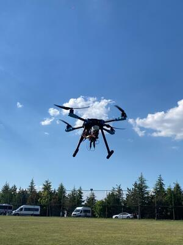
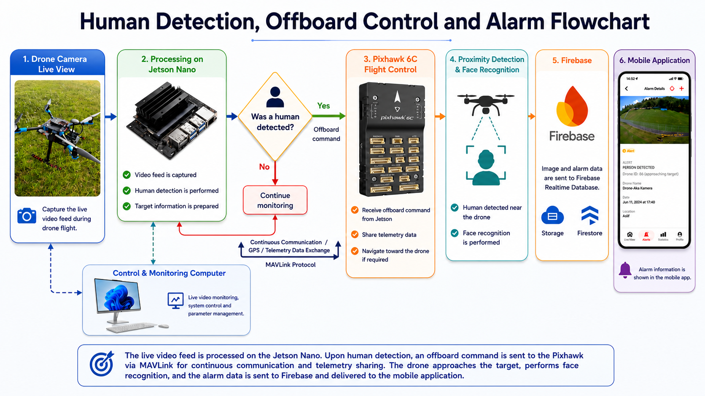

# 🚁 HOLO-PATROL: Autonomous Security Patrol Drone

[](https://www.python.org/)
[](https://developer.nvidia.com/deepstream-sdk)
[](https://mavsdk.mavlink.io/)
[](https://firebase.google.com/)

**Real-time onboard face recognition · 3D Visual Servoing · Jetson Nano · MAVSDK · Firebase Mobile Integration**
      
Bachelor's thesis project — Başkent University, Department of Computer Engineering, 2026  
**Authors:**Melih Can Kesgin, Mehmet Ali Karaca, Doğa Küçükkayalar, Ecem Dilan Ayaz
**Advisor:** Asst. Prof. Dr. İclal Çetin Taş  
**Supported by:** TürkTrust  

<!-- GÖRSEL 1: BURAYA DRONUN VEYA POSTERİNİN YÜKSEK KALİTELİ BİR FOTOĞRAFINI EKLE -->


## 📺 Field Validation & Demo

<!-- GÖRSEL 2: BURAYA UÇUŞ VE HEDEF TAKİBİ YAPAN KISA BİR GIF EKLE -->


## 🚀 Overview

This repository presents an end-to-end autonomous UAV security ecosystem. The system transforms a standard quadcopter into an intelligent patrol unit utilizing Edge AI, advanced facial recognition, and real-time cloud technologies. 

Operating on a Holybro X500 V2 frame, the system uses an NVIDIA Jetson Nano as a companion computer to process aerial video. When an unauthorized entry or an unrecognized face is detected during a routine patrol mission, the AI subsystem overrides the flight controller via MAVSDK (Offboard mode) to autonomously track the target in 3D space. Simultaneously, high-resolution evidence is transmitted to a custom mobile application via Firebase.

## 🌟 Key Highlights

* **Full UAV Hardware & AI Integration:** Holybro X500 V2 UAV platform synchronized with a Pixhawk 6C flight controller and Jetson Nano.
* **Feature-Based Behavior & Face Analysis:** Overcoming the limitations of aerial camera motion, the system utilizes feature-based recognition to identify hidden or masked faces, prioritizing deep feature extraction over simple movement speed heuristics.
* **3D Visual Servoing (P-Controller):** Dynamic target tracking in 3D space, calculating autonomous Yaw rotation, Forward/Backward approach, and Altitude Hold to maintain a safe distance from the suspect.
* **Failsafe & Mission Interruption:** The AI and flight control subsystems are decoupled. The operator can toggle Offboard mode via RC; upon deactivation, the UAV safely halts in Position mode, awaiting commands to resume its Geofenced patrol.
* **Real-Time Cloud & Mobile Alerts:** Instantaneous Firestore database updates and evidence image uploads triggering alerts on a custom mobile application.

## 🏗️ System Architecture

The architecture relies on asynchronous communication between the perception unit (Jetson Nano), the flight controller (Pixhawk), and the cloud (Firebase).

<!-- GÖRSEL 3: BURAYA SİSTEM MİMARİSİ BLOK ŞEMASINI (Kamera -> Jetson -> Pixhawk / Firebase) EKLE -->


## 🛠️ Hardware Specification

| Component | Specification |
| :--- | :--- |
| **UAV Frame** | Holybro X500 V2 quadcopter platform |
| **Flight Controller** | Pixhawk 6C (PX4 firmware) |
| **Edge Compute** | NVIDIA Jetson Nano Developer Kit |
| **Telemetry / Comm** | UART (`ttyTHS1`) at 115200 baud |
| **Battery** | Profuse 8000 mAh 65C 4S LiPo |
| **Ground Control** | QGroundControl |
| **RC Transmitter** | Configured with dedicated Offboard/Mission toggle (CH8) |

## 🧠 DeepStream and MAVSDK Pipeline

The deployment workflow targets the NVIDIA Jetson Nano, optimizing video processing through hardware acceleration while maintaining a strict 20Hz async flight control loop.

* **Inference:** GStreamer pipeline captures the feed, passing it through TensorRT optimized YOLOv8 engines for human/face detection.
* **Visual Servoing:** Bounding box coordinates are translated into spatial errors (X-axis for Yaw, Y-axis for Altitude, Z-axis for Distance).
* **Flight Control:** MAVSDK asynchronously calculates velocity setpoints (`VelocityBodyYawspeed`) using tuned P-Gains and sends them to the Pixhawk. Safe altitude limits (min 3.0m) are hardcoded into the pipeline.
* **Cloud Sync:** A background thread uploads annotated frames to Firebase Storage and writes telemetry/threat data to Firestore without blocking the flight loop.

## 📂 Repository Structure

```text
holo-patrol-drone/
│
├── docs/
│   ├── system_architecture.md
│   ├── behavior_analysis.md
│   ├── hardware_setup.md
│   └── mobile_integration.md
│
├── media/
│   ├── flight_demo.gif
│   ├── cover_photo.jpg
│   └── system_diagram.png
│
├── src/
│   ├── trace_3d_tracker.py       # Core MAVSDK & DeepStream logic (Sample)
│   └── firebase_config.json      # Template for cloud integration
│
├── LICENSE
└── README.md
