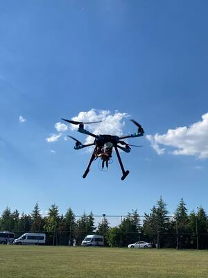
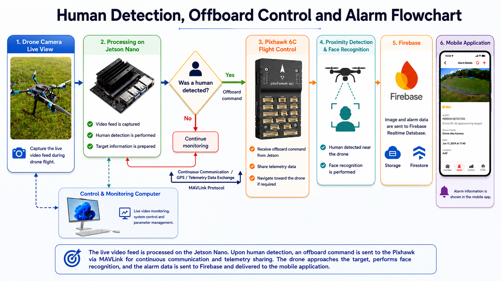

# 🚁 HOLO-PATROL: Autonomous Security Patrol Drone

[](https://www.python.org/)
[](https://developer.nvidia.com/deepstream-sdk)
[](https://mavsdk.mavlink.io/)
[](https://firebase.google.com/)

**Real-time onboard face recognition · 3D Visual Servoing · Jetson Nano · MAVSDK · Firebase Mobile Integration**
      
Bachelor's thesis project — Başkent University, Department of Computer Engineering, 2026
**Authors:** Melih Can Kesgin, Mehmet Ali Karaca, Doğa Küçükkayalar, Ecem Dilan Ayaz
**Advisor:** Asst. Prof. Dr. İclal Çetin Taş
**Supported by:** TürkTrust

<!-- GÖRSEL 1: BURAYA DRONUN VEYA POSTERİNİN YÜKSEK KALİTELİ BİR FOTOĞRAFINI EKLE -->


## 📺 Field Validation & Demo

<!-- GÖRSEL 2: BURAYA UÇUŞ VE HEDEF TAKİBİ YAPAN KISA BİR GIF EKLE -->


## 🚀 Motivation & Overview

Traditional security systems rely heavily on static camera networks or manual drone patrols, which are susceptible to human error and response delays. **HOLO-PATROL** was engineered to bridge this gap by introducing a fully autonomous, proactive aerial security solution aligned with the UN Sustainable Development Goal 9 (Industry, Innovation and Infrastructure)[cite: 7].

This repository presents an end-to-end autonomous UAV security ecosystem[cite: 7]. Before any physical deployment, the event flow was rigorously de-risked using a Gazebo / PX4 SITL simulation. Operating on a Holybro X500 V2 frame, the system uses an NVIDIA Jetson Nano as a companion computer to process aerial video[cite: 7]. When an unauthorized entry or an unrecognized face is detected during a routine patrol mission, the AI subsystem overrides the flight controller via MAVSDK (Offboard mode) to autonomously track the target in 3D space[cite: 7]. Simultaneously, high-resolution evidence is transmitted to a custom mobile application via Firebase[cite: 7].

## 🎯 Operational Workflow

The system operates in a decoupled, multi-stage workflow:
1. **Routine Patrol:** The UAV executes a predefined GPS-based geofenced patrol via QGroundControl (Mission Mode), sustaining operations for approximately 15-20 minutes per mission[cite: 7].
2. **Threat Detection:** The onboard Jetson Nano continuously runs YOLOv8 and facial recognition pipelines on the live camera feed[cite: 7].
3. **AI Override & Target Lock:** Upon detecting a threat, the Jetson takes command via UART, engaging Offboard mode[cite: 7]. It tracks the target dynamically using 3D Visual Servoing[cite: 7].
4. **Cloud Alert:** Evidence frames and telemetry are pushed to Firebase, triggering instant notifications on the mobile security dashboard[cite: 7].
5. **Resume Patrol:** Once the threat is cleared or the operator toggles the RC switch, the drone safely halts and awaits the command to resume its original geofenced route[cite: 7].

## 🌟 Key Highlights

* **Full UAV Hardware & AI Integration:** Holybro X500 V2 UAV platform synchronized with a Pixhawk 6C flight controller and Jetson Nano[cite: 7].
* **Advanced Face Verification:** Utilizes a Dlib HOG-based face detector paired with FaceNet to extract 128-dimensional facial embeddings for high-accuracy authorization[cite: 7].
* **Feature-Based Behavior Analysis:** Overcoming the limitations of aerial camera motion, the system utilizes feature-based recognition to identify hidden or masked faces, prioritizing deep feature extraction over simple movement speed heuristics[cite: 7].
* **3D Visual Servoing (P-Controller):** Dynamic target tracking in 3D space, calculating autonomous Yaw rotation, Forward/Backward approach, and Altitude Hold to maintain a safe distance from the suspect[cite: 7]. A hard 3-meter altitude floor reliably blocks further AI-commanded descent for enhanced safety[cite: 6].
* **Failsafe & Mission Interruption:** The AI and flight control subsystems are decoupled[cite: 7]. The operator can toggle Offboard mode via RC; upon deactivation, the UAV safely halts in Position mode[cite: 7].
* **Real-Time Cloud Alerts:** Instantaneous Firestore updates and image uploads trigger alerts on a custom mobile application[cite: 7]. Alert uploads run in a background thread so that network activity never blocks the flight-control loop.

## 🏗️ System Architecture

The architecture relies on asynchronous communication between the perception unit (Jetson Nano), the flight controller (Pixhawk), and the cloud (Firebase)[cite: 7].

<!-- GÖRSEL 3: BURAYA SİSTEM MİMARİSİ BLOK ŞEMASINI EKLE -->


## 🛠️ Hardware Specification

| Component | Specification |
| :--- | :--- |
| **UAV Frame** | Holybro X500 V2 quadcopter platform[cite: 7] |
| **Flight Controller** | Pixhawk 6C (PX4 firmware)[cite: 7] |
| **Edge Compute** | NVIDIA Jetson Nano Developer Kit[cite: 7] |
| **Telemetry / Comm** | UART (`ttyTHS1`) at 115200 baud[cite: 7] |
| **Battery** | Profuse 8000 mAh 65C 4S LiPo[cite: 7] |
| **Ground Control** | QGroundControl[cite: 7] |
| **RC Transmitter** | Configured with dedicated Offboard/Mission toggle (CH8)[cite: 7] |

## 🧠 DeepStream and MAVSDK Pipeline

The deployment workflow targets the NVIDIA Jetson Nano, optimizing video processing through hardware acceleration while maintaining a strict 20Hz async flight control loop[cite: 7].

* **Capture:** The Sony IMX477 camera captures frames at 60 FPS via the CSI interface[cite: 5].
* **Inference:** GStreamer pipeline passes the feed through TensorRT optimized engines for human/face detection[cite: 7].
* **Visual Servoing:** Bounding box coordinates are translated into spatial errors (X-axis for Yaw, Y-axis for Altitude, Z-axis for Distance)[cite: 7]. 
* **Flight Control:** MAVSDK asynchronously calculates velocity setpoints (`VelocityBodyYawspeed`) using tuned P-Gains[cite: 7]. Safe altitude limits (min 3.0m) are hardcoded into the pipeline[cite: 7].
* **Cloud Sync:** A background thread uploads annotated frames to Firebase without blocking the 20Hz flight loop[cite: 7].

## 📊 Field Results & Performance

The system was rigorously validated in real-world outdoor scenarios:
* **Inference Speed:** Maintained an average processing time of ~69 ms (approximately 14.5 FPS) on the Jetson Nano[cite: 5].
* **Detection Accuracy:** Achieved an 88% combined accuracy rate for human detection and face verification during dynamic flight[cite: 7].
* **System Latency:** Recorded an average end-to-end latency of just 0.8 seconds from the moment of detection to the FCM push notification on the mobile client[cite: 7].
* **Reliability:** Successfully kept the false positive rate at 8%, demonstrating strong resilience to outdoor lighting variations[cite: 7].

## 📂 Repository Structure

```text
holo-patrol-drone/
│
├── docs/
│   ├── system_architecture.md        # Layered architecture overview
│   ├── behavior_analysis.md          # State machine and verification
│   ├── hardware_setup.md             # Physical wiring and configurations
│   ├── software_environment.md       # Target environment and dependencies
│   ├── visual_servoing.md            # P-Controller and tracking logic
│   └── field_validation.md           # Progressive real-flight test guide
│
├── media/
│   ├── flight_demo.gif
│   ├── cover_photo.jpg
│   └── system_diagram.png
│
├── src/
│   ├── test_yaw.py                   # Stage 1: Yaw-only controller
│   ├── test_3d_tracker.py            # Stage 2: Full 3D visual servoing
│   ├── main.py                       # Gazebo / SITL simulation prototype
│   └── firebase_config.json          # Template for cloud integration
│
├── LICENSE
└── README.md
```
# 🚀 Quick Start (Onboard Deployment)
After verifying the camera stream and MAVLink connection over /dev/ttyTHS1, you can initiate the autonomous tracking node. Ensure a compatible RTP/H.264 receiver is listening on UDP port 5000
```python
# Run the full 3D tracking script and stream video to the Ground Station IP
python3 src/test_3d_tracker.py <GROUND_STATION_IP>
```
Note: The script waits for the operator to switch the vehicle into OFFBOARD mode via the configured RC switch before it starts issuing any autonomous commands

# 🔮 Limitations & Future Work
Power Management: Continuous Edge AI inference combined with Wi-Fi cloud syncing causes significant voltage sags on the Jetson Nano. Dedicated BECs are highly recommended.

Night Operations: The current model is trained on RGB data; thermal/LWIR camera integration is planned for future iterations.

Swarm Capabilities: Expanding the Firebase architecture to support multi-drone synchronization and shared geofenced zones.

# 📜 Citation
If you reference this architecture or project, please cite:
```text
@thesis{holo_patrol_2026,
  title      = {Autonomous Security Patrol Drone capable of Intrusion Detection with Face Recognition},
  author     = {Kesgin, Melih Can and Karaca, Mehmet Ali and Küçükkayalar, Doğa and Ayaz, Ecem Dilan},
  year       = {2026},
  school     = {Başkent University, Faculty of Engineering},
  type       = {Bachelor's Thesis},
  department = {Computer Engineering}
}
```
# ⚖️ License
This project is licensed under the Creative Commons Attribution-NonCommercial 4.0 International License (CC BY-NC 4.0). See the LICENSE file for details.
