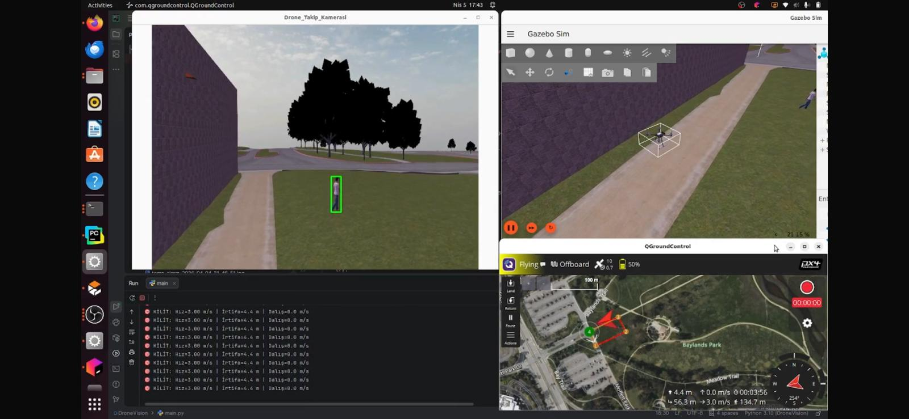

# Quick Start: Field Validation Sequence

HOLO-PATROL's flight-control logic was validated directly on the physical UAV in two progressive stages: a **yaw-only test** and a **full 3D visual tracking test**. Before any of this, an early software prototype of the same event flow (detection → Offboard hold → target following → Firebase alert) was also exercised in a **Gazebo / PX4 SITL simulation** to de-risk the logic before it ever touched real hardware. This guide documents the real-flight sequence used on the UAV; the simulation is mentioned here only as context for how the project reached this point.

<!-- PHOTO: Add a general field-test setup photo here (UAV on the ground, ground station, laptop, etc.) -->


## 0. Earlier Step: Gazebo / PX4 SITL Simulation

Before flying, the same detect → hold → offboard → track → alert flow was first run inside a Gazebo / PX4 SITL simulation to confirm that the overall control logic, MAVSDK plumbing, and Firebase alerting worked end-to-end without risking the aircraft. This simulation is not covered step-by-step in this guide — it was a desktop-only validation stage and is not part of the onboard deployment path described below.

<!-- PHOTO: Add a screenshot or recording of the Gazebo simulation here (simulated camera view, QGroundControl, terminal output, etc.) -->


## 1. Stage One — Yaw-Only Test on the Physical UAV

The first real-flight controller, `test_yaw.py`, intentionally disables forward and vertical motion. Its only purpose is to verify that the vehicle can safely center a detected target using yaw rotation alone, before any translational autonomy is introduced.

### Preparation

- Mount the Jetson Nano and IMX477 camera securely on the airframe.
- Connect the Jetson to the Pixhawk 6C over `/dev/ttyTHS1` at `115200` baud.
- Confirm the DeepStream pipeline (`nvinfer` + `nvtracker` with the IOU tracker config) initializes without errors.
- Start an RTP/H.264 receiver on the ground station listening on UDP port `5000`.
- Keep sufficient open space around the aircraft and keep manual override available at all times.

Run the yaw test, passing the ground-station IP as the destination for the video stream:

```bash
python3 test_yaw.py <GROUND_STATION_IP>
```

The script connects to the Pixhawk over UART, waits for a stable connection, and then waits for the operator to switch the vehicle into `OFFBOARD` (or `GUIDED`) mode via the configured RC switch before it starts issuing any autonomous command.

### Test procedure

1. Take off and stabilize the vehicle under normal PX4 control.
2. Present one person inside the camera view.
3. Confirm that DeepStream assigns a track ID and highlights the target on the on-screen display (`YAW TEST ID:<id>`).
4. Enable Offboard mode using the configured RC switch.
5. Move the target slowly to the left and right in front of the camera.
6. Verify that the vehicle rotates to reduce the horizontal image error, and that it stays still (no yaw command) once the target is within the horizontal dead zone.
7. Return control to the pilot by switching out of Offboard mode.

During this stage, forward, lateral, and vertical velocity are always sent as zero — only the yaw-rate term is ever non-zero. A successful result means that target selection, camera coordinates, the MAVSDK setpoint stream, yaw direction, dead-zone behavior, and pilot override all behave correctly.

<!-- PHOTO: Add a photo or short clip of the yaw-only flight test here -->


## 2. Stage Two — Full Onboard 3D Visual Tracking

Once yaw control was confirmed safe, `test_3d_tracker.py` was flown. This adds forward/backward approach and vertical (altitude) correction on top of the same yaw logic, plus a hard minimum-altitude safety boundary.

Run:

```bash
python3 test_3d_tracker.py <GROUND_STATION_IP>
```

### Test procedure

1. Confirm the real-time video stream and the `3D LOCK ID:<id> | ALT:<altitude>m` overlay are visible on the ground station.
2. Take off and stabilize well above the 3-meter safety floor.
3. Keep the target near the center of the frame before enabling Offboard mode.
4. Enable Offboard mode using the RC switch.
5. Move the target gradually to exercise each axis:
   - left and right, to test yaw correction,
   - closer and farther, to test the approach/retreat behavior driven by bounding-box height,
   - higher and lower in the frame, to test vertical (climb/descent) correction.
6. Confirm that all autonomous commands stop the instant the target is lost or the operator leaves Offboard mode.
7. Verify that descent is blocked once the telemetry-reported relative altitude reaches the 3-meter floor, even if the vertical error would otherwise call for further descent.
8. Confirm that the periodic Firebase alert upload (fired in a background thread) does not visibly interrupt the flight-control loop.

<!-- PHOTO: Add a photo or short clip of the full 3D tracking flight test here -->

## 3. Observable Runtime States

| State | Expected behavior |
|---|---|
| Pixhawk not yet connected | No flight commands are issued |
| Connected, not in Offboard | Perception and tracking run in the background, but no autonomous velocity is authorized |
| Offboard active, no target detected | Zero body velocity and zero yaw rate are streamed |
| Offboard active, target detected | Yaw (both stages), plus forward and vertical commands (3D-tracker stage only) are computed from the latest bounding box |
| Target centered within its dead zone | The corresponding axis command is set to zero |
| Relative altitude at or below 3.0 m | Any further descent command is overridden to zero |
| Pilot switches out of Offboard | Autonomous authority is immediately withdrawn |

## 4. Recommended Test Order

```text
Gazebo / PX4 SITL software validation (desktop only, not covered here)
    ↓
Stationary, propeller-off integration check on the real airframe
    ↓
Yaw-only flight test (test_yaw.py)
    ↓
Full 3D visual tracking flight test (test_3d_tracker.py)
    ↓
Firebase alert and ground-stream validation under flight conditions
```

At each stage, verify the sign and magnitude of every command before increasing gains or velocity limits further.

## 5. Completion Criteria

Validation is considered successful when:

- the correct person is selected and tracked,
- the displayed track ID remains stable enough for control,
- yaw rotates in the intended direction and settles within its dead zone,
- apparent target height regulates forward/backward approach distance as expected,
- vertical image error produces the intended climb or descent,
- no autonomous command is ever issued outside of Offboard mode,
- the vehicle immediately zeroes all commands when the target is lost,
- the pilot can regain control at any moment via the RC switch,
- the 3-meter altitude floor reliably blocks further AI-commanded descent,
- Firebase uploads and video streaming remain asynchronous and never stall the ~20 Hz control loop.
