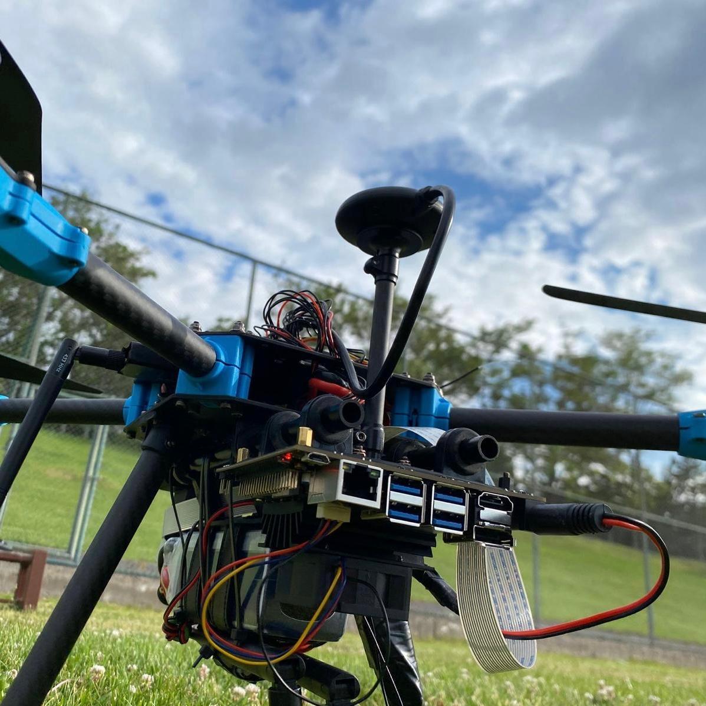

# Software Environment and Runtime Configuration

This document describes the software environment actually used to run HOLO-PATROL's real-flight controllers (`test_yaw.py` and `test_3d_tracker.py`) on the Jetson Nano. The repository focuses on system design and control logic; private credentials, trained model binaries, and full deployment-specific configuration files are not distributed.

An earlier, separate software environment — a Gazebo / PX4 SITL simulation running `main.py` — was used to validate the same conceptual event flow before real flight. It is noted briefly in Section 5 for context; it is not the deployment target described in the rest of this document.

<!-- PHOTO: Add a photo of the Jetson Nano + camera + Pixhawk assembly as physically wired for these tests -->


## 1. Target Environment

Both real-flight scripts run directly on the **NVIDIA Jetson Nano** mounted on the UAV, and control the vehicle over a **serial** connection to the Pixhawk 6C:

| Aspect | Configuration |
|---|---|
| Compute | NVIDIA Jetson Nano |
| Camera | Sony IMX477 via `nvarguscamerasrc`, captured at `1280 × 720` |
| Inference | NVIDIA DeepStream (`nvinfer`) with a TensorRT-backed YOLOv8 engine |
| Tracking | DeepStream `nvtracker`, IOU tracker configuration, `tracker-width=320`, `tracker-height=192` |
| Vehicle link | MAVSDK over `serial:///dev/ttyTHS1:115200` |
| Video output | H.264-encoded RTP stream to a ground-station receiver over UDP port `5000` |
| Cloud alerts | Firebase Admin SDK (Firestore + Cloud Storage) |

## 2. Software Stack (Onboard)

The onboard implementation, as written in `test_yaw.py` and `test_3d_tracker.py`, depends on:

- NVIDIA JetPack-compatible CUDA, TensorRT, and GStreamer components
- NVIDIA DeepStream SDK and its Python bindings (`pyds`)
- Python GObject bindings (`gi`, `Gst`, `GLib`)
- OpenCV (`cv2`) and NumPy — used in `test_3d_tracker.py`'s probe for frame handling
- `mavsdk` (Python) — specifically `mavsdk.System` and `mavsdk.offboard.VelocityBodyYawspeed` / `OffboardError`
- `firebase_admin` (`credentials`, `firestore`, `storage`)
- Standard library: `asyncio`, `threading`, `time`, `sys`, `datetime`

Exact package and JetPack/DeepStream versions should be recorded from the actual flight device rather than assumed from a desktop environment:

| Component | Tested version |
|---|---|
| JetPack / L4T | `ADD_FINAL_DEVICE_VERSION` |
| DeepStream SDK | `ADD_FINAL_DEVICE_VERSION` |
| TensorRT | `ADD_FINAL_DEVICE_VERSION` |
| Python | `ADD_FINAL_DEVICE_VERSION` |
| PX4 firmware | `ADD_FINAL_DEVICE_VERSION` |
| MAVSDK-Python | `ADD_FINAL_DEVICE_VERSION` |

## 3. Required Runtime Assets

Both onboard scripts reference the same set of external assets, none of which are generated by the Python code itself:

```text
project/
├── config_infer_primary_yoloV8.txt     # DeepStream nvinfer config (model, labels, confidence threshold)
├── firebase_key.json                   # Private service-account credential — never commit this
├── test_yaw.py
└── test_3d_tracker.py
```

The DeepStream tracker element additionally loads NVIDIA's shipped IOU tracker library and config directly from the standard DeepStream installation path:

```text
/opt/nvidia/deepstream/deepstream/lib/libnvds_nvmultiobjecttracker.so
/opt/nvidia/deepstream/deepstream/samples/configs/deepstream-app/config_tracker_IOU.yml
```

These paths are hardcoded in both scripts and must be updated if DeepStream is installed elsewhere on a given device.

### Model configuration

Neither script defines the detector engine, class labels, confidence threshold, or preprocessing — all of that lives in `config_infer_primary_yoloV8.txt`, which is passed to the `nvinfer` element's `config-file-path` property. This keeps the model configuration swappable without touching flight-control logic.

## 4. Camera, Video, and GStreamer Pipeline

Both scripts build the same DeepStream pipeline in code:

```text
nvarguscamerasrc → nvstreammux (1280×720, batch-size 1, live-source) → nvinfer (YOLOv8)
    → nvtracker (IOU) → nvvideoconvert → capsfilter (RGBA) → nvdsosd
    → nvvideoconvert → nvv4l2h264enc (bitrate 2,000,000) → rtph264pay → udpsink
```

The `udpsink` element streams the annotated, encoded video to a ground-station IP passed as the script's first command-line argument, on **UDP port 5000**:

```bash
python3 test_yaw.py <GROUND_STATION_IP>
python3 test_3d_tracker.py <GROUND_STATION_IP>
```

A compatible RTP/H.264 receiver must be listening on that IP and port for the operator to see the live feed. The detection probe itself is attached to the `nvdsosd` sink pad via `add_probe`, so all target-error extraction happens on the same buffer that gets drawn and streamed.

<!-- PHOTO: Add a screenshot of the ground-station receiver showing the live annotated RTP stream -->


## 5. Vehicle Communication

Both scripts connect to the flight controller with:

```text
serial:///dev/ttyTHS1:115200
```

This link is used to:

- read the current flight mode (to detect `OFFBOARD` / `GUIDED`),
- read relative altitude (`test_3d_tracker.py` only, via `monitor_telemetry`),
- start MAVSDK Offboard control,
- stream body-frame velocity and yaw-rate setpoints.

Neither script takes control automatically just because a person is detected — both wait for the operator to switch the vehicle into `OFFBOARD` or `GUIDED` mode via the configured RC switch, and both stream ten zero-velocity setpoints before calling `drone.offboard.start()`, satisfying PX4's pre-Offboard setpoint-streaming requirement.

## 6. Firebase Configuration

Both scripts initialize Firebase with:

```python
cred = credentials.Certificate("/home/user/Workspace/DeepStream-Yolo/firebase_key.json")
firebase_admin.initialize_app(cred, {'storageBucket': 'dronesecurityalert.firebasestorage.app'})
```

> Note: the credential path above is hardcoded to a specific development machine in the current scripts. It should be replaced with a relative or environment-configured path before broader reuse, and `firebase_key.json` itself must never be committed to the public repository.

Each alert document written to Firestore contains:

```text
title
message
timestamp
imageURL
id
locationName
severity
isActive
confidence
```

The alert image is uploaded to Cloud Storage and a signed URL (valid 1825 days) is generated for `imageURL`. Alert uploads run in a background thread (`threading.Thread(target=send_alert_to_firebase, ...)`) so that network activity never blocks the ~20 Hz flight-control loop, and a **15-second cooldown** (`ALERT_SAVE_COOLDOWN`) prevents uploading a new image on every processed frame.

Recommended `.gitignore` entries:

```gitignore
firebase_key.json
*.engine
__pycache__/
*.pyc
/tmp/
```

## 7. Configuration Checklist Before Deployment

Before running either onboard script, verify:

- the CSI camera is detected by `nvarguscamerasrc`,
- `config_infer_primary_yoloV8.txt` points to a valid, built TensorRT engine,
- class ID `0` corresponds to `person` in that configuration,
- the IOU tracker library and config paths exist at the expected DeepStream install location,
- `/dev/ttyTHS1` is wired to the Pixhawk and configured for MAVLink at `115200` baud,
- the ground-station IP passed as the script argument is reachable,
- UDP port `5000` is free and a receiver is listening,
- `firebase_key.json` and the storage bucket name are valid for the target Firebase project,
- the RC flight-mode switch reliably enters and exits Offboard/Guided mode,
- PX4's own geofence, battery, link-loss, and position failsafes are configured independently of this AI application.

## 8. For Reference: Earlier Gazebo / PX4 SITL Environment

Before the onboard scripts above were written, the same high-level event flow (detect → hold → Offboard → follow → alert) was validated in software using `main.py`, which connected to a simulated vehicle over `udpin://127.0.0.1:14540`, read frames from a Gazebo camera stream via OpenCV/GStreamer, and ran detection with Ultralytics YOLOv8s instead of DeepStream. This simulation environment is mentioned here only for context on how the project's control logic was first proven out — it is not part of the onboard deployment path documented above, and its full setup is intentionally not detailed in this file.

## 9. Documentation Scope

This document covers the software environment, required assets, and configuration checks for the real-flight onboard pipeline. It intentionally omits private credentials, the complete production flight application, trained model binaries, and any deployment-specific security settings.
