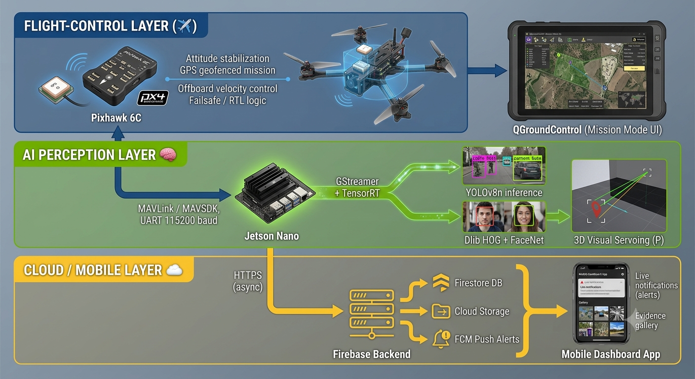

# 🏗️ System Architecture

HOLO-PATROL is built on three independently operating but asynchronously communicating layers: the **Flight-Control Layer**, the **AI Perception Layer**, and the **Cloud/Mobile Layer**. This decoupled design ensures that flight safety is never dependent on the AI inference pipeline — even if the Jetson Nano crashes or lags, the Pixhawk continues to operate safely under its own failsafe logic.

## 1. Layered Architecture Overview

## 2. Layer Details

### 2.1 Flight-Control Layer
The Pixhawk 6C, running PX4 firmware, is responsible for the drone's core stabilization and navigation. Routine patrol missions are executed in **Mission Mode** along a GPS-based geofenced route defined via QGroundControl. When the AI layer detects a threat, the Pixhawk transitions into **Offboard Mode**, temporarily handing control over to velocity commands issued by the Jetson Nano. The operator can override this handoff at any time via the CH8 switch on the RC transmitter, forcing the drone back into Position Mode.

### 2.2 AI Perception Layer
Running on the Jetson Nano, this layer captures the camera feed through a GStreamer pipeline and passes it through a TensorRT-optimized YOLOv8n model. Upon human/threat detection, the face verification stage (Dlib HOG + FaceNet) is triggered. Results are classified according to the state machine detailed in `behavior_analysis.md`, and the 3D Visual Servoing algorithm is engaged when necessary.

### 2.3 Cloud / Mobile Layer
When a critical alarm is generated, a separate background thread asynchronously uploads evidence frames and telemetry data to Firebase (Firestore + Cloud Storage). This process never blocks the 20Hz flight control loop. Firebase Cloud Messaging (FCM) then sends an instant push notification to the mobile security app, alerting the operator in real time.

## 3. Data Flow & Timing

| Stage | Component | Approx. Duration / Frequency |
| :--- | :--- | :--- |
| Frame capture | IMX477 → CSI → GStreamer | 60 FPS |
| YOLOv8n inference | TensorRT engine on Jetson Nano | Avarage 14.5 FPS (~69 ms) |
| Face verification (Dlib + FaceNet) | Jetson Nano CPU/GPU | Triggered post-detection |
| Visual Servoing command computation | P-Controller | 20 Hz (synchronous flight loop) |
| MAVSDK velocity setpoint dispatch | `VelocityBodyYawspeed` | 20 Hz async |
| Firebase upload (evidence + telemetry) | Background thread | Non-blocking, event-triggered |
| FCM push notification | Firebase → Mobile app | ~0.8 s end-to-end latency |

## 4. Design Rationale: Why Decoupled Architecture?

A tightly coupled system — where the AI model directly issues low-level motor commands — would introduce unacceptable risk: any inference delay, model crash, or misclassification could destabilize the aircraft mid-flight. HOLO-PATROL instead treats the Jetson Nano as an **advisory/override layer** that communicates with the flight controller only through high-level MAVSDK velocity setpoints, over a UART link that the Pixhawk can disregard at any moment via the RC failsafe toggle. This mirrors best practices in safety-critical robotics, where perception and actuation are kept in separate, independently verifiable subsystems.

## 5. Communication Protocols Summary

| Link | Protocol | Direction | Purpose |
| :--- | :--- | :--- | :--- |
| Pixhawk ↔ Jetson Nano | MAVLink over UART (`ttyTHS1`, 115200 baud) | Bidirectional | Telemetry read / Offboard velocity write |
| Jetson Nano ↔ Ground Control | MAVLink (via Pixhawk relay) | Outbound | Mission status monitoring |
| Jetson Nano ↔ Firebase | HTTPS / Firebase SDK | Outbound | Evidence upload, alert triggers |
| Firebase ↔ Mobile App | FCM / Firestore listeners | Outbound | Real-time alert delivery |
