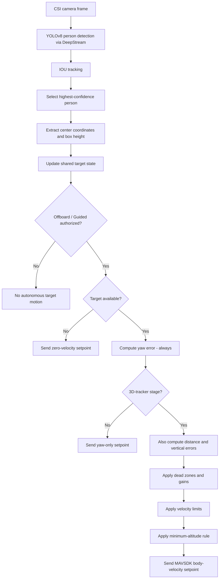

# Visual Servoing and Target-Following Logic

HOLO-PATROL uses image-based visual servoing. The controller does not reconstruct a metric 3D position from stereo vision or a depth sensor. Instead, it converts properties of a tracked person's two-dimensional bounding box — as reported by the DeepStream/TensorRT YOLOv8 pipeline and its IOU tracker — into body-frame velocity commands sent to PX4 over MAVSDK:

- horizontal image error → yaw rate,
- bounding-box height error → forward/backward velocity (3D-tracker stage only),
- vertical image error → downward/upward velocity (3D-tracker stage only).

The term **3D tracking** in this project refers to control over these three motion components derived from a single 2D bounding box, not full 3D pose estimation.

)

## 1. Development Stages

The controller evolved through three implementations, in this order:

| Implementation | Environment | Controlled motion |
|---|---|---|
| `gazebo_sitl_tracker.py` | Gazebo / PX4 SITL (early software validation) | Yaw, forward/backward, rule-based altitude band |
| `yaw_tracker.py` | Physical UAV | Yaw only |
| `visual_tracker_3d.py` | Physical UAV | Yaw, forward/backward, vertical velocity |

The Gazebo prototype (`gazebo_sitl_tracker.py`) was used purely to validate the event flow — detection, mode switching, target following, and Firebase alerting — in software, before any of it was flown. It is described only briefly in Section 8 for context; the two real-flight scripts are the primary subject of this document.

## 2. Perception Output (Real-Flight Pipeline)

The physical-UAV pipeline processes a `1280 × 720` frame from the Jetson's DeepStream/TensorRT YOLOv8 inference stage with an IOU tracker. Among all detections with class ID `0` (person), the probe selects the one with the **highest confidence** in the current frame and reads its tracker ID and bounding box:

```text
x1, y1, x2, y2               # bounding box corners
person_center_x = (x1 + x2) // 2
person_center_y = (y1 + y2) // 2
person_height    = y2 - y1
```

The image center used for error calculation is:

```text
IMAGE_CENTER_X = 640   # 1280 / 2
IMAGE_CENTER_Y = 360   # 720 / 2   (3D-tracker stage only)
```

The confidence threshold itself is not defined in these Python scripts — it belongs to the external DeepStream inference configuration (`config_infer_primary_yoloV8.txt`).

## 3. Coordinate and Command Convention

Both real-flight scripts send commands to PX4 through:

```text
VelocityBodyYawspeed(forward, right, down, yaw_rate)
```

Convention used throughout the project:

- `forward > 0`: move forward, `forward < 0`: move backward,
- `right` is always `0.0` — lateral translation is not used,
- `down > 0`: descend, `down < 0`: climb,
- `yaw_rate` follows PX4's body-frame convention (degrees/second).

All values sent are velocity setpoints; the AI application never issues low-level motor or attitude commands directly.

## 4. Yaw-Only Controller (`yaw_tracker.py`)

Horizontal image error:

```text
error_x = person_center_x - IMAGE_CENTER_X
```

Parameters actually used in the script:

```text
horizontal dead zone (DEAD_ZONE_X) = 40 pixels
yaw gain (YAW_K)                   = 0.035
yaw-rate limit (MAX_YAW_DEG_SEC)   = ±30 deg/s
```

Control law:

```text
yaw_speed = 0.0                                  when |error_x| < 40
yaw_speed = clamp(error_x * 0.035, -30.0, 30.0)  otherwise
```

Forward, lateral, and down velocities are always sent as zero:

```text
VelocityBodyYawspeed(0.0, 0.0, 0.0, yaw_speed)
```

The control loop runs on a `0.05` s cycle (~20 Hz), independent of camera capture or inference rate — it simply reads the latest error published by the DeepStream probe on each iteration.

## 5. Full Onboard Controller (`visual_tracker_3d.py`)

This controller regulates three independent image-space errors every ~20 Hz cycle.

### 5.1 Yaw Regulation

Identical logic and gain to the yaw-only stage:

```text
error_x = person_center_x - IMAGE_CENTER_X

yaw_speed = 0.0                                  when |error_x| < 40   (DEAD_ZONE_X)
yaw_speed = clamp(error_x * 0.035, -30.0, 30.0)   otherwise            (YAW_K, limit ±30 deg/s)
```

### 5.2 Following-Distance Regulation

Bounding-box height is used as a monocular distance proxy — a smaller box means a farther target, a larger box means a closer one.

```text
error_distance = TARGET_BOX_HEIGHT - person_height     # TARGET_BOX_HEIGHT = 300 px
```

```text
forward_speed = 0.0                                            when |error_distance| < 30   (DEAD_ZONE_DISTANCE)
forward_speed = clamp(error_distance * 0.018, -1.0, 1.5)        otherwise                    (FORWARD_K, +1.5 / -1.0 m/s limits)
```

This is a relative visual cue, not a metric measurement — the actual maintained distance shifts with camera angle, lens characteristics, target height, posture, and partial occlusion.

### 5.3 Vertical Regulation

```text
error_y = person_center_y - IMAGE_CENTER_Y
```

```text
down_speed = 0.0                                    when |error_y| < 35    (DEAD_ZONE_Y)
down_speed = clamp(error_y * 0.008, -0.5, 0.5)       otherwise             (DOWN_K, ±0.5 m/s limit)
```

Because MAVSDK uses a down-positive body axis, a target below the image center produces a positive (descend) command, and a target above center produces a negative (climb) command.

### 5.4 Minimum Altitude Protection

Relative altitude is read continuously from PX4 telemetry via a background task (`monitor_telemetry`). Before every command is sent:

```text
MIN_SAFE_ALTITUDE = 3.0   # meters

if global_altitude <= 3.0 and down_speed > 0:
    down_speed = 0.0
```

This blocks any additional AI-commanded descent once the 3-meter floor is reached. It supplements — and does not replace — PX4's own altitude, geofence, battery, and link-loss failsafes.

[Minimum Altitude Test](../media/tracking_test.git)

## 6. Target Selection and Loss Behavior

On every processed frame, the highest-confidence person detection is selected and its tracker ID and bounding box are written to shared state read by the control loop. If no person is detected in a frame:

```text
forward_speed = 0.0
down_speed    = 0.0
yaw_speed     = 0.0
```

is sent (in the yaw-only stage, forward and down are always zero regardless). This prevents the vehicle from continuing to execute the last known command after visual contact is lost.

Both scripts select the strongest detection per frame; they do not explicitly enforce that the same tracker ID remains locked across frames. Continuity of the tracked ID therefore depends on the IOU tracker and scene conditions.

## 7. Offboard Authorization

Perception and vehicle authority are kept separate in both real-flight scripts. A background task (`monitor_flight_mode`) continuously watches the PX4 flight mode string; autonomous velocity setpoints are only streamed while the mode contains `OFFBOARD` or `GUIDED`.

Before calling `drone.offboard.start()`, both scripts first stream **ten** zero-velocity setpoints at `0.05` s intervals, satisfying PX4's requirement that setpoints already be flowing before Offboard mode is activated. Once active, setpoints continue at roughly `20 Hz`.

The moment the operator switches out of Offboard mode, the internal flag is cleared, autonomous commands stop, and control returns fully to the pilot — making the RC flight-mode switch the primary human override in both real-flight stages.

## 8. Earlier Software Validation: Gazebo Prototype (`gazebo_sitl_tracker.py`)

Before either real-flight script existed, the same overall concept was exercised in Gazebo / PX4 SITL using `gazebo_sitl_tracker.py`. This prototype was intentionally more experimental and used different parameters, a different detector, and a simpler altitude strategy:

| Parameter | Gazebo prototype (`gazebo_sitl_tracker.py`) | Real-flight tracker (`visual_tracker_3d.py`) |
|---|---:|---:|
| Frame size | `640 × 480` | `1280 × 720` |
| Detector | YOLOv8s via Ultralytics, confidence threshold `0.62` in Python | YOLOv8 via DeepStream/TensorRT, threshold set externally |
| Vehicle connection | `udpin://127.0.0.1:14540` | `serial:///dev/ttyTHS1:115200` |
| Target box-height goal | `350 px` | `300 px` |
| Yaw gain | `0.015` | `0.035` |
| Forward gain | `0.025` | `0.018` |
| Forward limit | `+3.0 / -0.5 m/s` | `+1.5 / -1.0 m/s` |
| Yaw limit | `±20 deg/s` | `±30 deg/s` |
| Vertical strategy | Fixed altitude band (descend above 4.5 m, climb below 3.5 m) | Target-centered vertical visual servoing with a hard 3 m descent floor |
| Zero-setpoints before Offboard | 15 | 10 |
| Control loop delay | `0.02 s` | `0.05 s` |
| Mode entry | Automatic (`drone.action.hold()` then Offboard, triggered by first detection) | Manual (waits for the operator to switch into Offboard/Guided via RC) |

The most important behavioral difference: the Gazebo prototype takes control automatically the instant a person is detected, whereas both real-flight scripts always wait for explicit operator authorization before issuing any autonomous command. This change was a deliberate safety decision made between the simulation stage and real flight testing.


## 9. Runtime Flow (Real-Flight Pipeline)



## 10. Design Limitations

- bounding-box height is a relative distance cue, not metric depth,
- only one target is controlled at a time,
- lateral body velocity is fixed to zero in every stage,
- target selection is based on highest per-frame confidence rather than a persistent, mission-level target-lock policy,
- the controllers are pure proportional (P) controllers — no integral or derivative terms,
- camera-to-body calibration error is not estimated by the Python control layer,
- target motion is not predicted ahead of the current frame,
- the altitude floor depends on valid, low-latency PX4 relative-altitude telemetry.

These constraints should be kept in mind when interpreting the system as a research/thesis prototype rather than a certified autonomous navigation system.
